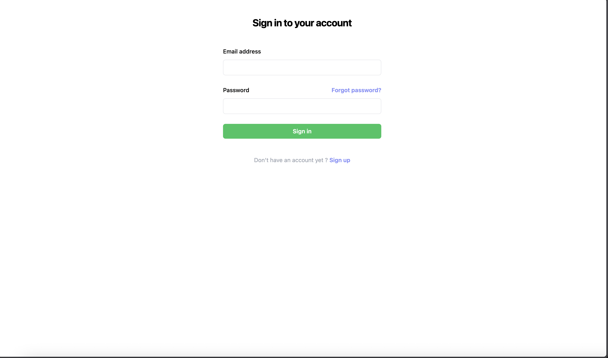
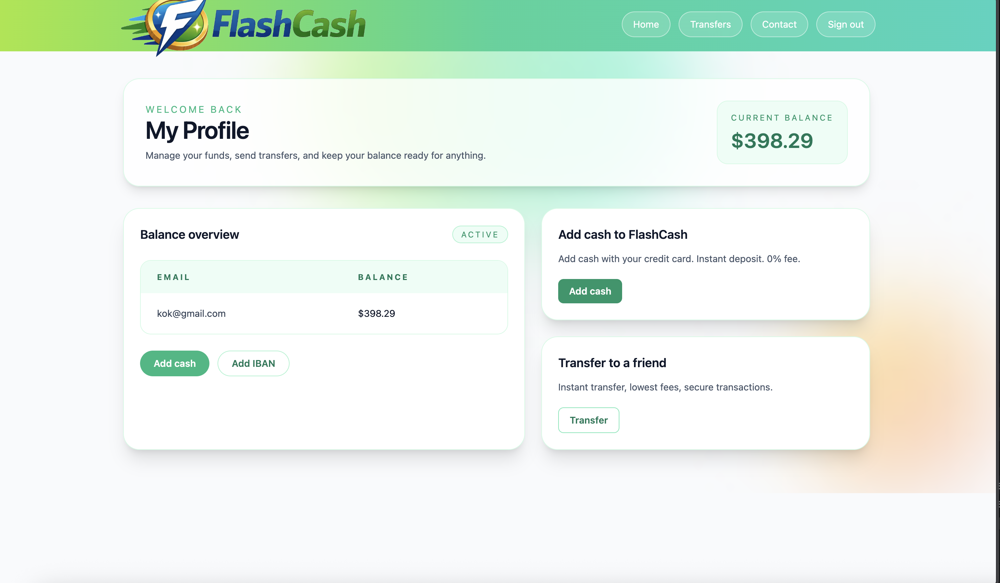
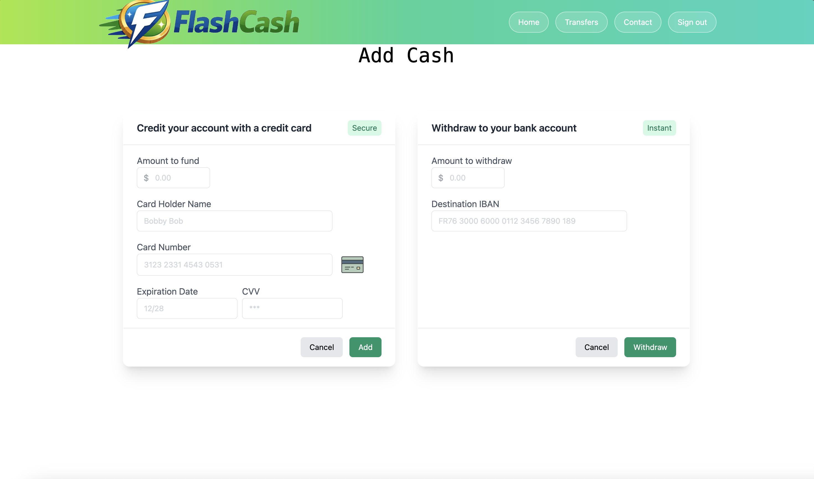

**FlashCash**
===========

Application web de type “banking” construite avec Spring Boot 3, Spring MVC, Thymeleaf, Spring Data JPA et Spring Security.
Le projet implémente un login via Spring Security avec page de connexion personnalisée et utilisation de Thymeleaf pour le rendu côté serveur.

Stack / dépendances

• Java 17
• Spring Boot 3.0.4
• Spring Web (MVC)
• Thymeleaf
• Spring Data JPA
• MySQL Connector
• Spring Security (form login)
• Lombok

## Captures

### Login

### Home

### Deposit

